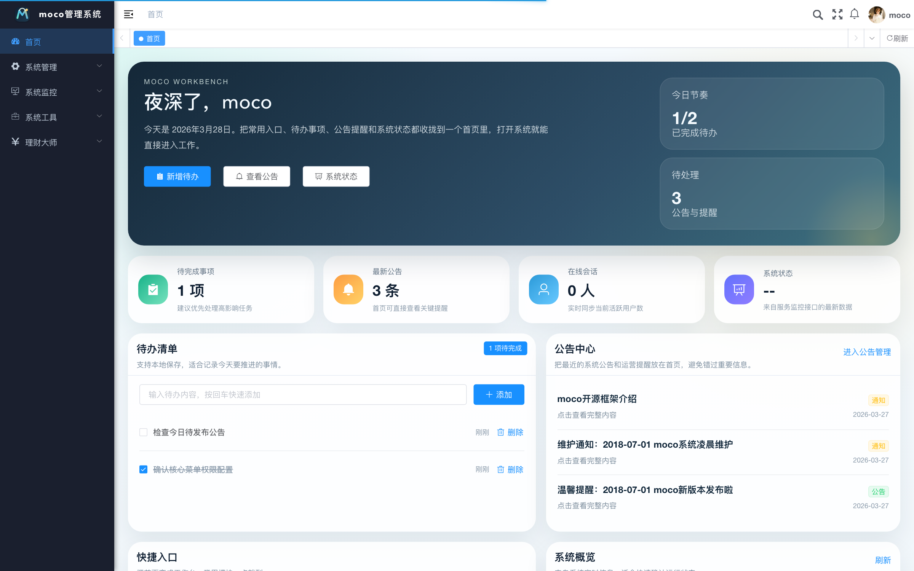
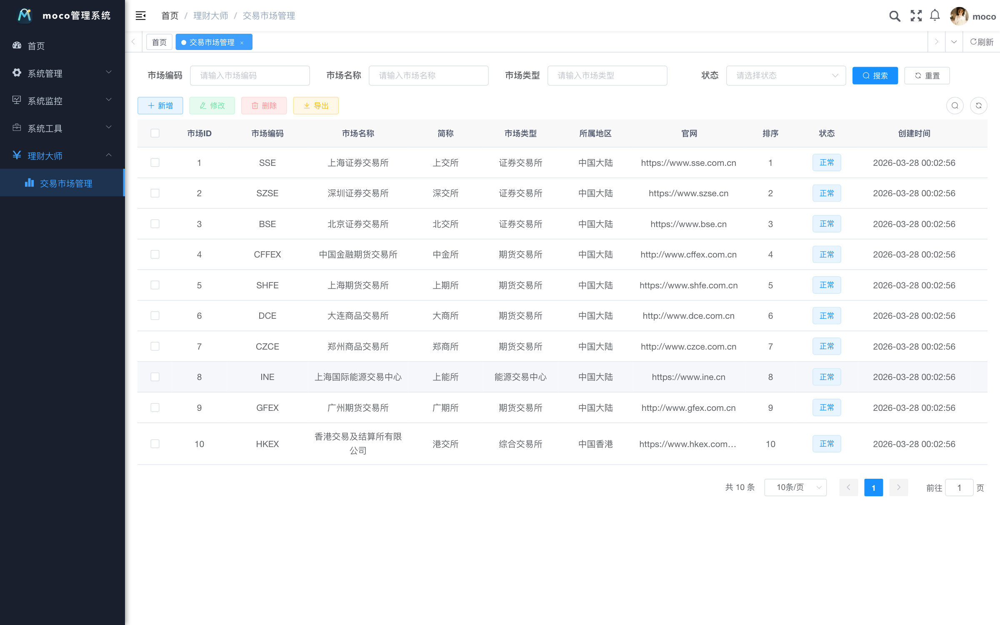

# moco-admin

`moco-admin` 是一个基于 [`RuoYi-Vue`](https://github.com/yangzongzhuan/RuoYi-Vue) 主线版本改造的前后端分离后台系统。项目已经统一完成 `moco` 品牌重命名，并对首页、Logo、脚本、初始化数据、默认配置和部分业务模块做了定制化调整。

它适合作为这些场景的起点：

- 个人后台管理系统
- 中小型业务管理平台
- 内部运营与管理工作台
- 基于成熟后台框架的二次开发项目

## 功能亮点

- 完整的用户、角色、菜单、部门、岗位、字典、参数、公告管理
- 基于 Spring Security + JWT 的认证与权限控制
- MySQL + Redis 的标准后台架构
- 系统监控、缓存监控、在线用户、操作日志、登录日志
- Quartz 定时任务管理
- 代码生成器
- 已重做的工作台首页
- 已新增 `理财大师 -> 交易市场管理` 业务模块
- 统一的 `moco` Logo、标题、脚本和命名体系

## 系统截图

### 工作台首页



### 交易市场管理



## 技术栈

后端：

- Java 17
- Spring Boot 4
- Spring Security
- MyBatis
- Druid
- Redis
- MySQL 8

前端：

- Vue 2
- Vuex
- Vue Router
- Element UI
- Axios

## 项目结构

```text
moco-admin/
├── moco-admin/        # Spring Boot 启动模块
├── moco-common/       # 通用能力、基础模型、工具类、常量
├── moco-framework/    # 安全、配置、拦截器、异常处理
├── moco-system/       # 系统核心业务
├── moco-quartz/       # 定时任务模块
├── moco-generator/    # 代码生成模块
├── moco-ui/           # Vue 前端管理端
├── sql/               # 初始化 SQL
├── docs/              # 架构与部署文档
├── docker-compose.yml # MySQL / Redis 本地依赖
├── moco.sh            # Linux / macOS 启动脚本
└── moco.bat           # Windows 启动脚本
```

## 快速开始

### 1. 环境要求

- JDK 17+
- Maven 3.8+
- Node.js 18+
- MySQL 8.x
- Redis 7.x

### 2. 启动 MySQL 和 Redis

项目根目录已经提供 `docker-compose.yml`：

```bash
docker compose up -d
```

或者直接使用一体化脚本：

```bash
./moco.sh deps-up
```

### 3. 构建后端

```bash
cp .env.example .env
mvn clean package -DskipTests
```

### 4. 启动后端

Linux / macOS：

```bash
chmod +x moco.sh
./moco.sh start
```

如果希望一键拉起依赖、后端和前端：

```bash
./moco.sh up
```

Windows：

```bat
moco.bat start
```

Windows 一体化命令：

```bat
moco.bat deps-up
moco.bat up
```

### 5. 启动前端

```bash
cd moco-ui
npm install
npm run dev -- --port 18081
```

也可以直接使用脚本单独管理前端：

```bash
./moco.sh web-start
./moco.sh web-status
./moco.sh web-logs
./moco.sh web-stop
```

Windows：

```bat
moco.bat web-start
moco.bat web-status
moco.bat web-logs
moco.bat web-stop
```

## 默认访问信息

- 前端开发地址：`http://localhost:18081`
- 后端接口地址：`http://localhost:8080`
- Swagger 地址：默认关闭，设置 `MOCO_SWAGGER_ENABLED=true` 后访问 `http://localhost:8080/swagger-ui/index.html`
- 默认账号：`admin`
- 默认密码：`admin123`

首次部署后请立即修改默认管理员密码，并使用环境变量覆盖数据库、Redis、JWT、Druid 控制台等敏感配置。

## 验证码开关

登录页和注册页验证码不是前端写死，而是由系统参数控制。

- 参数键：`sys.account.captchaEnabled`
- `true`：开启验证码
- `false`：关闭验证码

### 方式一：后台页面修改

开启步骤：

1. 登录后台
2. 进入 `系统管理 -> 参数设置`
3. 搜索 `sys.account.captchaEnabled`
4. 打开参数编辑页
5. 将参数值改成 `true`
6. 保存

关闭步骤：

1. 登录后台
2. 进入 `系统管理 -> 参数设置`
3. 搜索 `sys.account.captchaEnabled`
4. 打开参数编辑页
5. 将参数值改成 `false`
6. 保存

### 方式二：直接修改数据库

开启验证码：

```sql
update sys_config
set config_value = 'true'
where config_key = 'sys.account.captchaEnabled';
```

关闭验证码：

```sql
update sys_config
set config_value = 'false'
where config_key = 'sys.account.captchaEnabled';
```

### 修改后如何生效

项目会把系统参数缓存到 Redis。如果你已经改了数据库或后台参数，但页面还没变化，按下面顺序处理：

1. 退出当前登录并重新登录
2. 浏览器强制刷新页面：`Cmd + Shift + R`
3. 重启后端：`./moco.sh restart`
4. 如果还是没生效，删除 Redis 缓存键：`sys_config:sys.account.captchaEnabled`

删除 Redis 缓存键示例：

```bash
docker exec moco-redis redis-cli DEL sys_config:sys.account.captchaEnabled
```

### 如何确认是否已生效

调用验证码接口：

```bash
curl http://127.0.0.1:8080/captchaImage
```

返回结果中：

- `captchaEnabled: true` 表示验证码已开启
- `captchaEnabled: false` 表示验证码已关闭

## 当前定制内容

相较于上游主线，当前仓库已经完成这些改造：

- `若依 / ruoyi / ry` 全量迁移为 `moco`
- Java 包名统一调整为 `com.moco`
- Maven 模块统一为 `moco-*`
- 启动脚本改为 `moco.sh`、`moco.bat`
- 首页改造成工作台模式
- 品牌 Logo 与 favicon 改为 `moco`
- 新增 `理财大师 -> 交易市场管理`
- 初始化 SQL、菜单、字典、默认配置同步改为 `moco`

## 文档

- 架构文档：[architecture.md](/Users/makun/llm_project/moco-admin/docs/architecture.md)
- 部署文档：[deployment.md](/Users/makun/llm_project/moco-admin/docs/deployment.md)
- 版本记录：[CHANGELOG.md](/Users/makun/llm_project/moco-admin/CHANGELOG.md)
- 部署示例文件：[deploy](/Users/makun/llm_project/moco-admin/deploy)
- 环境变量示例：[.env.example](/Users/makun/llm_project/moco-admin/.env.example)

## 开发建议

- 新增后端业务时，优先落在 [`moco-system`](/Users/makun/llm_project/moco-admin/moco-system)
- 新增前端页面时，优先放在 [`moco-ui/src/views`](/Users/makun/llm_project/moco-admin/moco-ui/src/views)
- 新增接口封装时，放在 [`moco-ui/src/api`](/Users/makun/llm_project/moco-admin/moco-ui/src/api)
- 运行时文件使用 `logs/` 和 `runtime/`，不要纳入版本控制

## 许可证与来源

本项目基于上游 `RuoYi-Vue` 改造，保留原项目的 MIT License。

- 许可证文件：[LICENSE](/Users/makun/llm_project/moco-admin/LICENSE)
- 上游项目：[`RuoYi-Vue`](https://github.com/yangzongzhuan/RuoYi-Vue)
